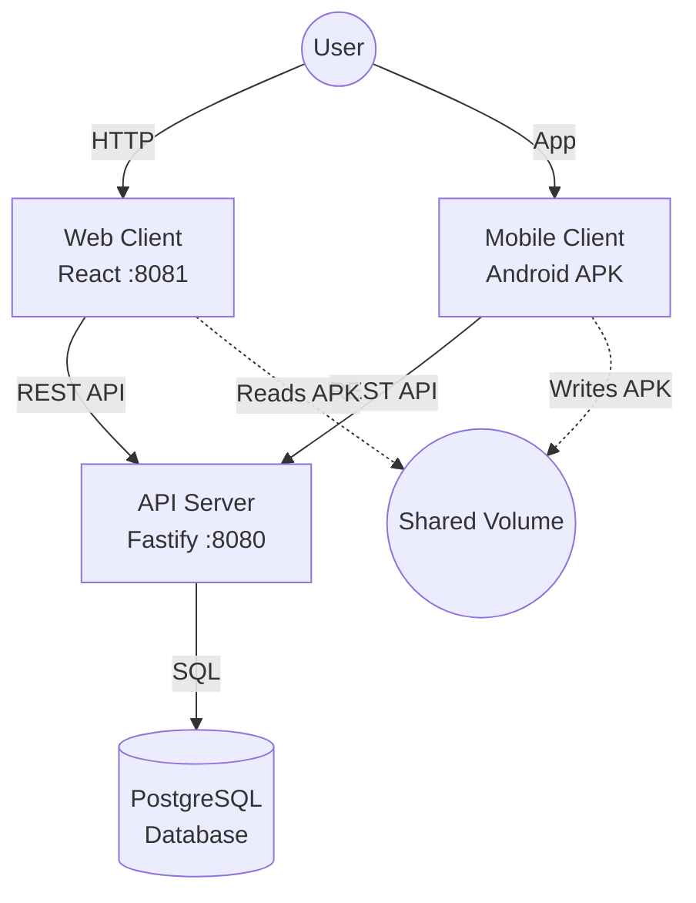

# AREA — Automation Platform

> *Action-REAction: Create your own automation flow.*

AREA is a modular automation platform inspired by IFTTT and Zapier. It enables users to connect **Actions** (event triggers) from various services to **Reactions** (operations) in a unified, extensible ecosystem.

The platform is built as a **Monorepo** orchestrating three main micro-services:

- **Application Server (API)**: Powered by **Fastify**. Hosts business logic, user management, and the AREA engine.
- **Web Client**: Powered by **React (Vite)**. Browser interface for configuring workflows.
- **Mobile Client**: Powered by **React Native (Expo)**. Android application to manage automations on the go.

---

## 🏗️ Architecture

The project runs on a containerized environment orchestrated by Docker Compose.



---

## 🚀 Getting Started

### Prerequisites
- [Docker](https://www.docker.com/get-started)
- [Docker Compose](https://docs.docker.com/compose/install/)
- [Node.js](https://nodejs.org/) (for local development)
- [Git](https://git-scm.com/)

### 🐳 Running with Docker (Recommended)

This is the standard way to run the project for testing and review.

1. **Clone the repository:**

    ```bash
    git clone https://github.com/Matyslgr/AREA.git
    cd AREA
    ```

2. **Launch the stack:**

    ```bash
    docker-compose up --build
    ```

3. **Access the services:**
    - **Web Client**: `http://localhost:8081`
    - **API Server**: `http://localhost:8080`
    - **Mobile APK**: Downloadable at `http://localhost:8081/shared/client.apk` and install it on your Android device.

### 💻 Local Development (Monorepo)

If you want to contribute to the code, use Turborepo to run services locally with hot-reload.

1. **Install dependencies:**

    ```bash
    npm install
    ```

2. **Run services:**

    ```bash
    npm run dev
    ```

    *This will start the Server (Fastify), Web (Vite), and Mobile (Expo) in parallel.*

---

## 📚 Documentation

Detailed documentation is available in the `docs/` folder:

- [API Specification](./docs/API_SPECIFICATION.md): List of endpoints and JSON formats.
- [Database Schema](./docs/DATABASE_SCHEMA.md): ER diagrams and table descriptions.
- [Security Strategy](./docs/SECURITY_STRATEGY.md): Overview of authentication and data protection measures.

---

## 🛠️ Tech Stack

| Component | Technology |
| :--- | :--- |
| Monorepo | Turborepo |
| Server | Node.js, Fastify, TypeScript, Prisma (ORM) |
| Database | PostgreSQL |
| Web | React, Vite, TypeScript, TailwindCSS, shadcn/ui |
| Mobile | React Native, Expo |
| DevOps | Docker, GitHub Actions |

---

## 🤝 Contributing

We welcome contributions!

- For **Git Workflow** (branches, commits), please read [CONTRIBUTING.md](https://github.com/Matyslgr/.github/blob/main/CONTRIBUTING.md).
- For **Adding Features** (New Services, Actions), please read [HOWTOCONTRIBUTE.md](./docs/HOWTOCONTRIBUTE.md).
