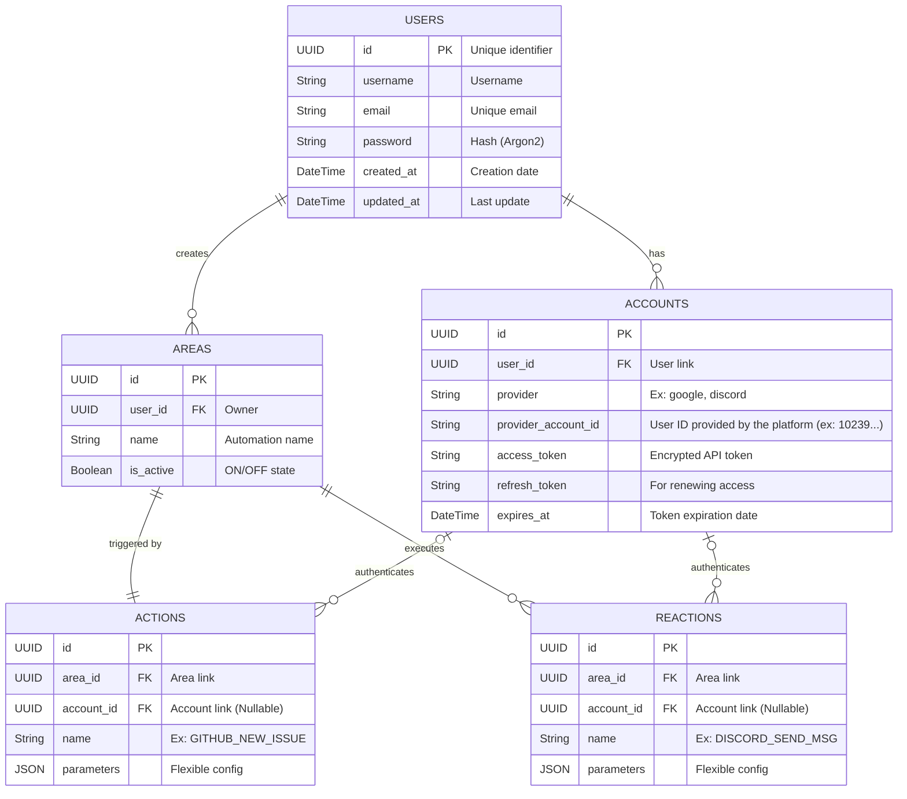

# Architecture of the Database Schema (ERD)

This document provides an overview of the architecture of the database schema used in our application. It outlines the key entities, their attributes, and the relationships between them.

## ER Diagram

## Implementation Details
- `parameters` fields in both `ACTIONS` and `REACTIONS` tables are stored as JSON to allow for flexible configuration options depending on the type of action or reaction.
- Tokens OAuth must be stored encrypted to ensure security. (e.g., using AES encryption)
