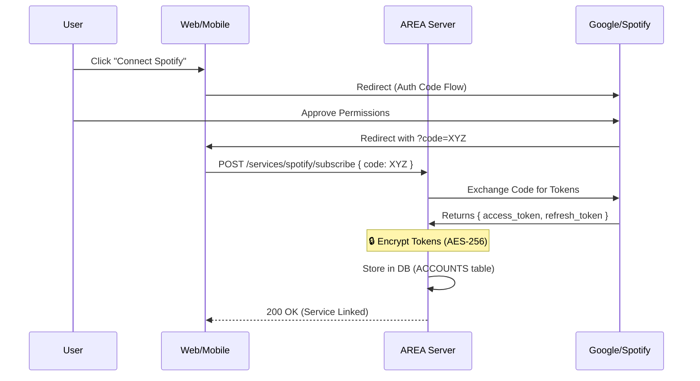

# Security & Authentication Strategy

This document outlines the security measures, authentication flows, and data protection strategies for the AREA project.

## 1. User Authentication (AuthN)

We use a stateless authentication mechanism compatible with both Web and Mobile clients.

### Password Management
- **Algorithm:** We strictly use **Argon2id** (via `node-argon2` or similar).
- **Rationale:** Argon2 is the winner of the Password Hashing Competition and offers better resistance to GPU cracking and side-channel attacks compared to Bcrypt.
- **Policy:** Passwords are never stored in plain text.

### Session Management: JWT (JSON Web Tokens)
Since our API serves both a Web Client and a Mobile App, we use **JWTs** for stateless authentication.

- **Access Token:**
  - **Lifespan:** Short (e.g., 15 minutes).
  - **Storage:**
    - *Web:* In-memory (variables) or HttpOnly Cookie (to prevent XSS).
    - *Mobile:* Encrypted Secure Storage.
  - **Usage:** Sent in the HTTP Header: `Authorization: Bearer <token>`.

- **Refresh Token:**
  - **Lifespan:** Long (e.g., 7 days).
  - **Usage:** Used to obtain a new Access Token without re-entering credentials.
  - **Storage:** Secure database storage linked to the user device/session.

## 2. OAuth2 Strategy (External Services)

The application handles two types of OAuth2 interactions:
1.  **Sign-in with Google/GitHub:** To identify the user.
2.  **Service Linking (The Core Feature):** To obtain access rights (Tokens) for services like Spotify, Outlook, etc.

### The Flow (Authorization Code Flow)
We strictly avoid the "Implicit Flow" (security risk). We use the **Authorization Code Flow**.

1.  **Client (Front):** Redirects user to the Provider (e.g., Google) asking for specific scopes (e.g., `gmail.readonly`).
2.  **Provider:** Redirects back to Client with a temporary `code`.
3.  **Client:** Sends this `code` to the Server API (`POST /services/{id}/subscribe`).
4.  **Server:** Exchanges the `code` + `client_secret` for `access_token` and `refresh_token` directly with the Provider.
5.  **Server:** Encrypts and stores tokens in the DB.

## 3. Data Protection (Encryption at Rest)

The `ACCOUNTS` table contains sensitive OAuth tokens. These must not be readable if the database is compromised.

**Encryption Strategy**
- **Algorithm: AES-256-GCM** (Galois/Counter Mode) or **AES-256-CBC**.

- **Key Management**: The Encryption Key (Secret) is stored in **Environment Variables** (.env) on the server, **NEVER** in the database or git repo.

- **Process**:
    - **Write**: Before saving to `ACCOUNTS`, the server encrypts the `access_token` and `refresh_token`.
    - **Read**: When the AREA Engine triggers an action, the server fetches the encrypted token, decrypts it using the ENV secret, and uses it to call the API.

## 4. API Security Standards

To ensure the API is robust:

- **CORS (Cross-Origin Resource Sharing):** Configured to allow only trusted domains (our Web Client URL).

- **Helmet:** Use `fastify-helmet` to set secure HTTP headers (X-XSS-Protection, etc.).

- **Rate Limiting:** Basic protection against brute-force attacks on /auth/login routes.
- **Input Validation:** All incoming JSON bodies (Zod or JSON Schema) are validated to prevent injection attacks.

## 5. Security Policy

For vulnerability reporting and general security guidelines, please refer to our organization's security policy: [View Security Policy](https://github.com/Matyslgr/.github/blob/main/SECURITY.md)
